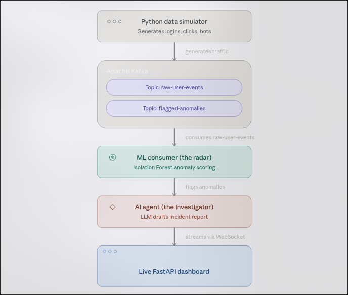

#  Autonomous Real-Time Anomaly Investigation Engine

The **Autonomous Anomaly Engine** is an event-driven streaming pipeline that monitors live user behavior to detect fraud, bots, and system glitches in milliseconds. 

Unlike traditional batch-processing models that analyze "yesterday's data," this system ingests live clickstream data via Apache Kafka, scores it using an unsupervised machine learning model (Isolation Forest) in real-time, and triggers an **Autonomous LLM Agent** to investigate flagged anomalies, generate forensic reports, and recommend mitigation actions.

## Key Features
*   **Real-Time Streaming:** Simulates 1,000+ live user events per second using Apache Kafka (KRaft mode).
*   **Unsupervised ML Detection:** Uses `scikit-learn`'s Isolation Forest to profile user behavior and assign real-time anomaly scores without labeled data.
*   **Autonomous AI Investigator:** When an anomaly is flagged, an LLM Agent (Groq/Llama 3.1) is triggered. It analyzes the payload, determines the threat level (Bot vs. Slow Human), and generates a structured JSON forensic report.
*   **Live SOC Dashboard:** A dark-themed, WebSocket-powered FastAPI frontend where AI forensic reports pop up in real-time.
*   **Fully Containerized:** The entire stack (Kafka, ML Model, AI Agent, API) spins up with a single `docker-compose up` command.

## System Architecture




## Tech Stack
*   **Streaming Broker:** `Apache Kafka` (KRaft mode, no Zookeeper)
*   **Machine Learning:** `scikit-learn` (Isolation Forest, StandardScaler)
*   **AI Agent Framework:** `LangChain` (Tool Calling, JSON parsing)
*   **LLM Provider:** `Groq` (Llama 3.1 8B Instant)
*   **Backend/API:** `FastAPI` + `WebSockets`
*   **Containerization:** `Docker` & `Docker Compose`

## How to Run Locally

1. **Clone the repository:**
   ```bash
   git clone https://github.com/sam-k99/anomaly-engine.git
   cd anomaly-engine
   ```

2. **Set Environment Variables:**
   Create a `.env` file in the root directory and add your Groq API key:
   ```env
   GROQ_API_KEY=gsk_your_groq_api_key_here  (or any llm but recommended groq for its speed)
   ```

3. **Spin up the infrastructure:**
   Ensure Docker and Docker Compose are installed, then run:
   ```bash
   docker-compose up -d --build
   ```
   *Note: The ML model requires 200 events to train its baseline. It will take about 2-3 minutes after starting for the first anomalies to appear on the dashboard.*

4. **View the Live Dashboard:**
   Open your browser and go to `http://localhost:8000` to watch the AI SOC reports pop up in real-time.

## Engineering Challenges & Solutions
*   **Challenge:** Docker Compose race conditions. The Python pipeline started before Kafka was fully ready to accept connections, causing `Connection refused` errors.
    *   **Solution:** Implemented a Docker `healthcheck` on the Kafka container. The Python pipeline uses `depends_on: condition: service_healthy` to wait until Kafka's port 9092 is actively accepting TCP connections before booting.
*   **Challenge:** The Isolation Forest model was flagging "slow humans" as anomalies because the feature `processing_time_ms` (0-3000) heavily outweighed the `action_code` (1-6).
    *   **Solution:** Implemented `StandardScaler` to normalize the feature space, ensuring the model weighed velocity and action type equally. Furthermore, the LLM Agent was introduced as a "Smart Triage" layer to distinguish between true bot anomalies (5ms) and false positive human anomalies (2500ms).
*   **Challenge:** Kafka listeners inside Docker cannot use `localhost` to communicate between containers.
    *   **Solution:** Configured `KAFKA_ADVERTISED_LISTENERS` to the Docker service name `kafka:9092` and updated all Python consumers to dynamically resolve the broker via environment variables
